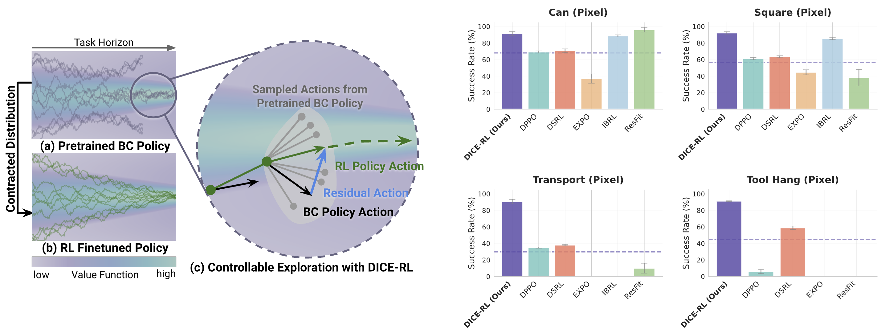

# From Prior to Pro: Efficient Skill Mastery via Distribution Contractive RL Finetuning (DICE-RL)

[[Paper](https://arxiv.org/abs/2603.10263)]&nbsp;&nbsp;[[Website](https://zhanyisun.github.io/dice.rl.2026/)]&nbsp;&nbsp;[[Datasets](https://zhanyisun.github.io/dice.rl.2026/)]&nbsp;&nbsp;[[Checkpoints](https://zhanyisun.github.io/dice.rl.2026/)]

[Zhanyi Sun](https://zhanyisun.github.io/), [Shuran Song](https://shurans.github.io/)

Stanford University



> DICE-RL is a sample-efficient and stable finetuning framework for diffusion- and flow-based Behavior Cloning policies. 

## Installation

1. Clone the repository.
```console
git clone git@github.com:zhanyisun/dice-rl.git
cd dice-rl
```

2. Install core dependencies with a conda environment.
```console
conda create -n dice-rl python=3.8 -y
conda activate dice-rl
pip install -e .
```

3. Install Robomimic and dependencies.
```console
pip install -e .[robomimic]
```

4. [Install MuJoCo for Robomimic](installation/install_mujoco.md).

5. Set environment variables for data and logging directory (default is `data_dir/` and `log_dir/`), and set WandB entity.
```
source script/set_path.sh
```

## Download datasets and checkpoints from Hugging Face
Download all checkpoints and datasets from Hugging Face with the following command. This will download the datasets and checkpoints to the specified data and log directories respectively. If you only want to download specific datasets or checkpoints, you can find the links on the Hugging Face page and download them manually.

```console
bash script/download_hf.sh
```
The dowloaded datasets have the following structure:
```
data_dir/
├── robomimic
│   ├── {env_name}-low-dim
│   │   ├── ph_pretrain
│   │   └── ph_finetune
│   └── {env_name}-img
│       ├── ph_pretrain
│       └── ph_finetune
```

`data_dir/robomimic/{env_name}-low-dim/ph_pretrain` and 
`data_dir/robomimic/{env_name}-img/ph_pretrain`contain the datasets used for pretraining the BC policies, and `data_dir/robomimic/{env_name}-low-dim/ph_finetune` and `data_dir/robomimic/{env_name}-img/ph_finetune` contain the datasets used for finetuning the DICE-RL policies. `ph_finetune` is essentially the same as `ph_pretrain` with trajectories truncated to have exactly one success at the end to ensure the value learning between offline data and online data is consistent.. The datasets are in numpy format, and each dataset folder contains `train.npy` and `normalization.npz`. 

The checkpoints have the following structure:
```
log_dir/
├── robomimic-pretrain
│   ├── pretrained_bc_policy_{env_name}_low_dim
│   └── pretrained_bc_policy_{env_name}_img
└── robomimic-finetune
    ├── finetune_rl_policy_{env_name}_low_dim
    └── finetune_rl_policy_{env_name}_img
```
`log_dir/robomimic-pretrain/pretrained_bc_policy_{env_name}_low_dim` contains the pretrained BC checkpoints for state-based policies, and `log_dir/robomimic-pretrain/pretrained_bc_policy_{env_name}_img` contains the pretrained BC checkpoints for image-based policies.

### Generate your own data
You can optionally generate your own state and image datasets from the raw data downloaded from [this link](https://huggingface.co/datasets/wintermelontree/raw_robomimic_data/tree/main) or the official Robomimic repository. We use `robomimic==0.5.0` and `robosuite==1.4.1`. You can use `script/dataset/process_robomimic_dataset.py` to process raw datasets from Robomimic. See `script/dataset/README.md` for details. 

## Evaluating finetuned RL checkpoints and pretrained BC checkpoints
To directly evaluate the finetuned RL checkpoints and pretrained BC checkpoints and to get success rates for both, use the following commands. Make sure to change the pretrained checkpoint path in the config file of the finetuning checkpoint. The 
script/eval_rl_checkpoint.py script will automatically search for the corresponding pretrained BC checkpoint and evaluate it as well.

```console
python script/eval_rl_checkpoint.py  --ckpt_path  path_to_finetuned_checkpoint   --num_eval_episodes 10 --eval_n_envs 10
```
The output will include the success rates for both the finetuned RL checkpoint and the pretrained BC checkpoint, as well as the gain of the finetuned RL checkpoint over the pretrained BC checkpoint. You can specify `--num_eval_episodes` and `--eval_n_envs` to change the number of evaluation episodes and parallel evaluation environments respectively.

## Pretraining
**Note**: You may skip pre-training if you would like to use the default checkpoint (available for download at Hugging Face) for finetuning.

To pretrained state-based BC policies on the Robomimic dataset, use the following command. Make sure to change the paths to dataset and normalizer in the config file. You can optionally save eval videos during pretraining by changing the `save_video` flag in the config file to `True` an specifiy the number of eval envs for video saving.

```console
python script/run.py --config-name=pre_flow_matching_mlp --config-dir=cfg/robomimic/pretrain/{env_name}/
```

To pretrained image-based BC policies on the Robomimic dataset, use the following command. 

```console
python script/run.py --config-name=pre_flow_matching_unet_img --config-dir=cfg/robomimic/pretrain/{env_name}/
```

## Finetuning
To finetune the pretrained BC policies with DICE-RL, use the following command. Make sure to change the paths to finetuning dataset and normalizer in the config file, and also change the pretrained checkpoint path to the one you want to finetune from.

To finetune state-based policies, use the following command. You can optionally save eval videos during finetuning by changing the `save_video` flag in the config file to `True` an specifiy the number of eval envs for video saving.

```console
python script/run.py --config-name=ft_distill_residual_flow_mlp --config-dir=cfg/robomimic/finetune/{env_name}/
```

To finetune image-based policies, use the following command. 
```console
python script/run.py --config-name=ft_distill_residual_flow_unet_img --config-dir=cfg/robomimic/finetune/{env_name}/
```

### Key configurations for DICE-RL finetuning
Below we list some key configurations for DICE-RL finetuning that you can change in the config files. For more details on other configurations, please refer to the config files and the code.

* `bc_loss_weight`: the weight for BC loss. Setting it to 0 corresponds to pure online RL finetuning without distillation, and setting it to a large value corresponds to pure offline BC finetuning without online RL. In our experiments, we find that setting it to 50-100 works well across all tasks.

* `gradient_steps`: the number of gradient steps for each RL policy update. Used together with `n_envs` and `actor_update_freq`, it determines the UTD ratio for finetuning. In our experiments, we find that keeping the UTD ratio around 1 gives stable and sample-efficient training. 

* `n_step`: the number of steps for n-step return. In our experiments, we find that increasing this number to 3 or 5 works well for long-horizon tasks. 

* `critic_ensemble_size`: the number of critics in the critic ensemble. In our experiments, we find that using an ensemble of 10 critics works well for all tasks.

# Code Acknowledgements
Our code base is built on top of the following repositories. We thank the authors for open-sourcing their code.
- [DPPO](https://github.com/irom-princeton/dppo): our pretraining and finetuning stack is built on top of the DPPO codebase. 
- [Robomimic](https://github.com/ARISE-Initiative/robomimic) and [Diffusion Policy](https://github.com/real-stanford/diffusion_policy): the encoder and policy architecture for image-based policies are adapted from the codebases of Robomimic and Diffusion Policy. 


If you find this codebase useful, consider citing:

```bibtex
@article{sun2026prior,
  title={From Prior to Pro: Efficient Skill Mastery via Distribution Contractive RL Finetuning},
  author={Sun, Zhanyi and Song, Shuran},
  journal={arXiv preprint arXiv:2603.10263},
  year={2026}
}
```

# Contact
If you have any questions, please feel free to contact [Zhanyi Sun](mailto:zhanyis@stanford.edu). If you leave an issue, please send me an accompanying email!
